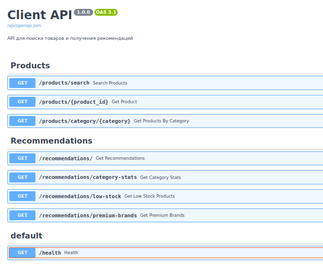

# kafka_hw_final

## Тема работы
"Разработка прототипа аналитической платформы для маркетплейса." 

## Требования
- ОС Linux (использовалась Ubuntu 22.04.5 LTS)
- Docker и Docker Compose (использовались версии 28.4.0 и 2.39.4)
- Make

## Содержание

- [Описание проекта](#описание-проекта)
- [Архитектура](#архитектура)
- [Запуск](#запуск-системы)
- [Компоненты системы](#компоненты-системы)
- [Безопасность](#безопасность)
---

## Описание проекта

Система демонстрирует реализацию микросервисной архитектуры на основе Apache Kafka для обработки потоковых данных о товарах интернет-магазина.

###  Основные возможности:
- **Потоковая обработка данных**
- **Полнотекстовый поиск**
- **Потоковая аналитика**
- **Рекомендательная система**
- **Мониторинг кластера**
- **Безопасность**
---

##  Архитектура

```
Producer ──▶ | Kafka Cluster (3 brokers + 3 mirrors) | ──▶ | Faust App |
                │            │            │               │
                │            │            │               └─▶ (shops_stock_accepted / banned) ──▶ Kafka
                │            │            ├─▶ Spark Analytics ──▶ product_recommendations
                │            │            ├─▶ Kafka Connect ──▶ Elasticsearch
                │            │            └─▶ Client API (logs → user_actions)
                │
                └─────────────────────────────────────────────────────────────────▶ ksqlDB (mat. views)
```

### Направление потока данных:

1. **Producer** генерирует данные о товарах и отправляет в `shops_stock_received`
2. **Faust App** валидирует данные, фильтрует забаненные товары → `shops_stock_accepted` / `shops_stock_banned`
3. **Kafka Connect** синхронизирует данные в Elasticsearch
4. **Client API** предоставляет REST API для поиска, логирует действия пользователей → `user_actions`
5. **Spark Analytics** агрегирует данные и формирует рекомендации → `product_recommendations`
6. **ksqlDB** строит материализованные представления для аналитики в реальном времени
7. **Mirror Maker 2** реплицирует топики между кластерами

---

## Запуск системы

#### NOTE: требуется ~12-16 ГБ RAM


1. **Клонирование репозитория**
    ```bash
    git clone git@github.com:A-Rogachev/kafka_hw_final.git
    cd kafka_hw_final
    ```


2. **Команды для взаимодействия с приложением**
    
    - *время инициализации системы может занять ~2-3 минут*

    | Команда | Действие | Комментарий|
    |----------|----------|----------|
    | <b>make</b> | Запуск кластера | запуск проекта |
    | <b>make stop</b>|Остановка приложения|удаление контейнеров и томов данных образов |
    | <b>make check</b>|Проверка работы контейнеров| псевдоним для <b>docker compose ps -a</b> |
    | <b>make help</b> | Описание команд | описание команд в Makefile |
    | <b>make analytics-logs</b> | Просмотр логов системы аналитики | вывод логов в stdout 
    | <b>make health</b> | Проверка статусов сервисов | статус доступности сервисов |
    | <b>make monitor</b> | Адреса для мониторинга | вывод инф-ии о доступе к мониторингу|


3. **Взаимодействие с Client Api**
    После успешного запуска проекта, эндпойнты API для пользователя доступны по адресу:
    [http://localhost:8000/api/openapi#/](http://localhost:8000/api/openapi#/)
    

---

## Компоненты системы

### 1. **Producer** (генерация данных)
Приложение генерирует данные о товарах и отправляет в Kafka (топик `shops_stock_received`).
Названия брендов, категории (включая запрещенные) и теги определены в **./producer/app/src/const.py**, 
названия товаров генерируются случайный образом и в 10 процентах случаев берутся из констант (для проверки поиска).

### 2. **Faust App** (потоковая обработка)
Приложение на базе faust-streaming обрабатывает полученные от магазинов данные, в случае нахождения
категории/типа/тегов товара в списках запрещенных **./faust_app/app/src/core/const.py**, запись попадает
в топик `shops_stock_banned`, иначе в топик `shops_stock_accepted`. Список запрещенных категорий/тегов доступен
по адресу [http://localhost:6066/banned_products/](http://localhost:6066/banned_products/)

### 3. **Kafka Connect** (ETL)
Из топика `shops_stock_accepted` данные поступают (синхронизируются в реальном времени) в Elasticsearch,
используется Elasticsearch Sink Connector **kafka-connect-elasticsearch:15.1.1**
Список плагинов -> [http://localhost:8083/connector-plugins/](http://localhost:8083/connector-plugins/)
Список коннекторов -> [http://localhost:8083/connectors/](http://localhost:8083/connectors/)


### 4. **Schema Registry** (управление схемами)
Централизованное хранилище схем для сериализации/десериализации сообщений Kafka.
Схемы определены в формате JSON Schema и хранятся в топике `_schemas`:
- **Product** — схема товаров для `shops_stock_received` и `shops_stock_accepted`
- **UserAction** — схема действий пользователей для `user_actions`
- **Recommendations** — схема рекомендаций для `product_recommendations`

Регистрация схем происходит автоматически при инициализации системы (скрипт **./infra/kafka/register-schema.sh**).
API эндпойнты:
- Список зарегистрированных схем: [http://localhost:8081/subjects](http://localhost:8081/subjects)
- Информация о схеме: `http://localhost:8081/subjects/{subject-name}/versions/latest`

### 5. **Analytics** (Spark Streaming)
Приложение с использованием библиотеки **pyspark** агрегирует данные из `source.shops_stock_received` в кластере-зеркале
и генерирует рекомендации (топ-бренды и топ-категории), после чего записывает их в `product_recommendations` того же кластера.

### 6. **ksqlDB** (Stream SQL)
  В реальном времени обновляются материализованные представления (статистика по категориям, низкий остаток, премиум-бренды) -
  используется кластер-зеркало.

### 7 **Client API** (REST API)
  Api на базе фреймворка FastAPI, реализован поиск из elasticsearch, а также запросы с использованием ksql. Часть запросов
  также логируется в `user-actions` в кластере-зеркале для возможной дальнейшей аналитики действий пользователей.

### 8. **Kafka UI** (веб-интерфейс)
  Доступен по [http://localhost:8080](http://localhost:8080), подключены основной и зеркальный кластеры.

### 9. **Мониторинг**

  | Сервис | URL | Данные для входа |
  |--------|-----|-------------|
  | **Prometheus** | http://localhost:9090 | — |
  | **Grafana** | http://localhost:3001 | admin / kafka |
  | **Alertmanager** | http://localhost:9193 | — |

  После входа в Grafana доступны следующие дашборды:

  1. **Broker Hard Disk Usage** — мониторинг дискового пространства
  2. **Broker JVM & OS** — состояние JVM и ОС
  3. **Broker Performance** — производительность брокеров
  4. **Cluster Health Check** — здоровье кластера
  5. **Cluster Replication** — репликация данных
  6. **Topics & Logs** — метрики топиков и логов

  Настроен алерт **KafkaBrokerDown**:
  - **Условие**: брокер недоступен более 1 минуты
  - **Severity**: critical
  - **Действие**: отправка уведомления в Alertmanager
---

## Безопасность

  Сертификаты сгенерированы заранее (для корректного запуска при проверке и разработке.)
  - `secrets/ca/` — Certificate Authority
  - `secrets/brokers/` — keystores и truststore для брокеров
  - `secrets/clients/` — сертификаты для клиентов (PEM)
  - `secrets/kafka_server_jaas.conf` — SASL/PLAIN credentials

  Права доступа (ACL):
  ```
  Основной кластер (kafka-1:9092):
    producer: запись (Write, Describe, Create) в shops_stock_received
    faust:
      чтение (Read, Describe) из shops_stock_received
      запись (Write, Describe, Create) в shops_stock_accepted, shops_stock_banned
      чтение (Read, Describe) всех consumer groups
      полный доступ (All) к внутренним топикам faust_app-* (changelog, assignor)
    client_api:
      чтение (Read, Describe) из shops_stock_accepted
      чтение (Read, Describe) всех consumer groups
      полный доступ (All) к внутренним топикам connect-* (Kafka Connect)
      полный доступ (All) к топику _schemas (Schema Registry)
  Зеркальный кластер (kafka-4-mirror:9092):
    client_api: запись (Write, Describe, Create) в user_actions
    analytics:
      чтение (Read, Describe) из source.shops_stock_accepted, user_actions
      запись (Write, Describe, Create) в product_recommendations
      чтение (Read, Describe) всех consumer groups
    ksql: запись (Write, Describe, Create) в user_actions (косвенно через client_api)
  ```

---

## Примечания

- Переменные окружения для настройки представлены в файле env.example
- Сборка некоторых контейнеров может занять время (analytics с pyspark, образ с коннектором elasticsearch)
